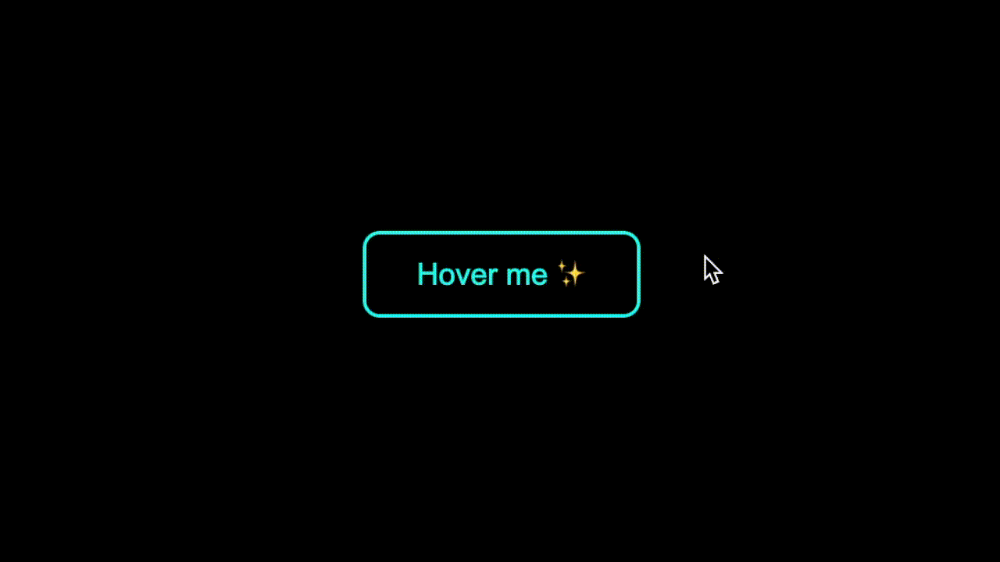

# Shining Button ✨

An interactive button with glowing and sparkling star effects. This project uses HTML, CSS, and JavaScript to create a visually stunning and dynamic user experience.

## Preview



## Features

- **Glowing Effect:** The button lights up and slightly enlarges when hovered.
- **Sparkling Stars:** Dynamic, glowing stars appear around the button.
- **Interactive Background:** The page background darkens when hovering over the button.

## Technologies Used

- **HTML5:** For the page structure.
- **CSS3:** For styling and animations.
- **JavaScript:** For dynamic star generation and hover effects.

## Project Structure

```plaintext
root/
├── public/
│   ├── index.html     # Main HTML file
│   ├── styles.css     # CSS file for styling
│   ├── index.js       # JavaScript file for functionality
└── README.md          # Project documentation

